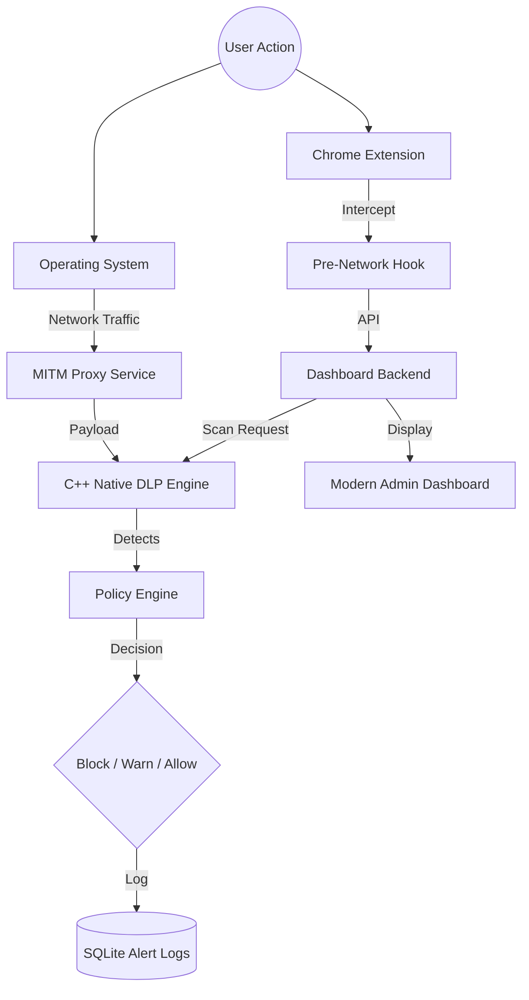

# 🛡️ SentinelGate DLP


<p align="center">
  <strong>The Next-Gen System-Wide Data Leak Protection (DLP) for the Modern Workplace.</strong>
</p>

<p align="center">
  
  
  
  
  
</p>

---

## 🌟 Overview

**SentinelGate** is a sophisticated, system-wide Data Leak Prevention (DLP) system designed to monitor, detect, and block the exposure of sensitive information (Secrets, API Keys, PII) across all desktop activities.

By combining a high-performance **C++ Detection Engine** with a flexible **System-Wide Proxy** and a **Pre-emptive Browser Layer**, SentinelGate ensures that your data never leaves your environment unauthorized.

## ✨ Key Features

- 🚀 **C++ Native Engine**: Blazing fast pattern scanning using `std::regex` and Shannon Entropy calculation for secret detection.
- 🌐 **System-Wide MITM Proxy**: Intercepts ALL HTTP/HTTPS traffic at the OS level using `mitmproxy`.
- 🧩 **Chrome/Edge Extension (MV3)**: Pre-network interception on Chrome-based browsers. Blocks sensitive data in `fetch`, `XHR`, forms, and **clipboard pastes** at the source.
- 📋 **Paste Protection**: Specifically hardened against data leaks to AI tools (ChatGPT, Claude, Gemini) and messaging apps.
- 📊 **Unified Dashboard**: Premium dark-mode interface for real-time monitoring, stats, and alert management.
- 🗄️ **Persistent Logging**: SQLite-backed alert logs with automatic data redaction for privacy.
- 🛠️ **DLP Simulator**: Integrated sandbox for testing rules and patterns directly from the browser.

## 🏗️ Architecture



## 🚀 Quick Start

### 1. Prerequisites
- Python 3.10+
- A C++ compiler (MSVC for Windows)
- `pip install -r requirements.txt`

### 2. Launching the Service
Start the unified orchestrator to launch the proxy, dashboard, and engine:
```powershell
python sentinelgate_service.py
```

### 3. Installing the SSL Certificate
To intercept HTTPS traffic, install the `mitmproxy` CA certificate:
```powershell
python sentinelgate_service.py --install-ca
```

### 4. Admin Dashboard
Open your browser and navigate to:
`http://127.0.0.1:5000`

## 📂 Project Structure

| File/Folder | Purpose |
|-------------|---------|
| `sentinelgate_service.py` | Main entry point & service orchestrator. |
| `sentinel_engine.cpp` | Core C++ DLP scanning logic (Native Performance). |
| `proxy_addon.py` | MITMproxy logic for handling system-wide traffic. |
| `dashboard.py` | Flask backend for the administration interface. |
| `extension/` | Manifest V3 Browser extension contents. |
| `rules.json` | Dynamic DLP rules (Regex, Entropy, etc.). |
| `alert_logger.py` | Handles database persistence and alert history. |

## 🛠️ Technology Stack

- **Core Engine**: C++17, Pybind11 (Python Bindings).
- **Network Layer**: mitmproxy.
- **Backend API**: Flask.
- **Frontend**: Vanilla CSS, Modern Typography, HSL Gradients.
- **Data Store**: SQLite.

## 🛡️ Security & Privacy
SentinelGate is designed with a **privacy-first** approach. All sensitive payloads are **masked/redacted** before being written to the database to ensure that the DLP system itself doesn't become a leak source for administrators.

---

<p align="center">Built by developers, for security teams. 🛡️</p>
